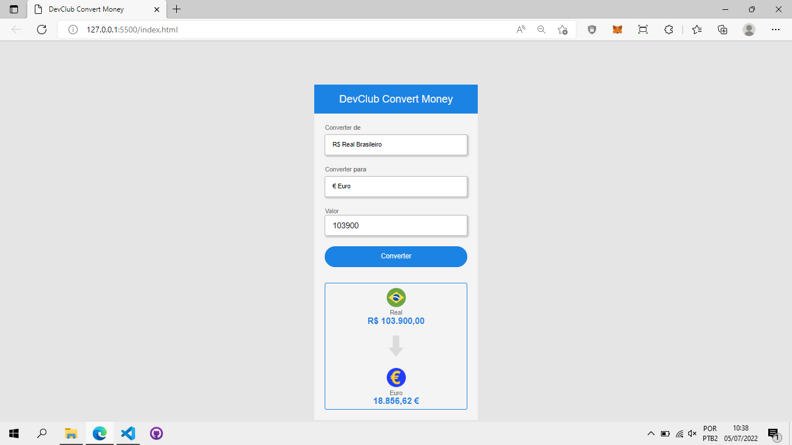

#Conversor de valores

> Resultado do Projeto Conversor de valores

### Sobre:

O projeto é um simples conversor de valores. ele converte Reais em: Dólar, Euro e Bitcoin

- [x] HTML
- [X] CSS
- [X] JAVASCRIPT

## 🤝 Colaboradores

Agradecemos às seguintes pessoas que contribuíram para este projeto:

<table>
  <tr>
    <td align="center">
      <a href="#">
         
        
          <b>Vagner Santos</b>
        
      </a>
    </td>
  </tr>
</table>

